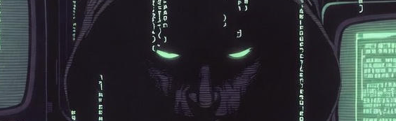

## dear [delta chat](https://get.delta.chat) users and newcomers ...


welcome to instant, interoperable and [privacy-preserving](privacy.html) messaging :)

welcome to the default onboarding server ({{ config.mail_domain }})
for delta chat users.  for details how it avoids storing personal information
please see our [privacy policy](privacy.html).


<a class="cta-button" href="dcaccount:https://{{ config.mail_domain }}/new">get a {{config.mail_domain}} chat profile</a>

if you are viewing this page on a different device
without a delta chat app,
you can also **scan this qr code** with delta chat:

🐣 **choose** your avatar and name

💬 **start** chatting with any delta chat contacts using [qr invite codes](https://delta.chat/en/help#howtoe2ee)

ᴄᴄᴄʟxxɪɪɪ
